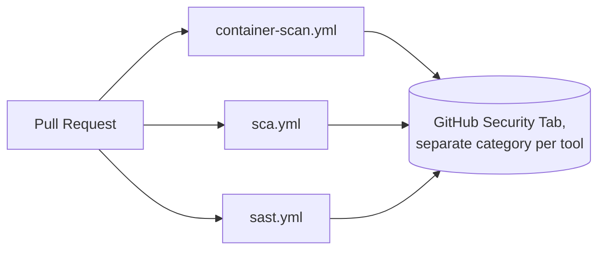

# Why Three Independent Pipelines, Not One

Container Scanning, SCA, and SAST are three separate GitHub Actions
workflow files, each with its own orchestrator script and its own gate,
rather than one combined "security" workflow.

(The MIP components run a fourth workflow, Gitleaks secret scanning, which
follows the same one-workflow-per-concern shape but is not part of the
reusable blueprint, see
[reference/pipeline-secret-scanning.md](../reference/pipeline-secret-scanning.md).)

## What each one actually scans

| Pipeline | Scans | Doesn't scan |
|---|---|---|
| Container Scanning | The built Docker image, and the Dockerfile itself | Application source code, application dependencies directly |
| SCA | Application dependencies, via a generated SBOM | Source code, the container image |
| SAST | Application source code | Dependencies, the container image, the Dockerfile |

These are three genuinely different artifacts, at three different points
in the software supply chain: what you wrote, what you depend on, and what
you ship. A single monolithic workflow scanning all three would either
need to run everything sequentially (slower feedback, one broken step
blocking unrelated findings from surfacing) or grow complex conditional
logic to keep them apart internally, without gaining anything a clean
split doesn't already provide.

## Independent triggers and parallel execution

All three trigger on the same events (`pull_request`, `workflow_dispatch`,
and a weekly Monday 02:00 UTC schedule) but run as independent GitHub
Actions jobs. This means:

- A slow or failing Container Scanning run doesn't delay SCA or SAST
  results on the same PR.
- Each pipeline uploads its own SARIF category to the GitHub Security tab,
  so a reviewer can see exactly which layer (code, dependencies, image)
  a finding came from.
- Each has its own gate model appropriate to what it's actually measuring,
  see [why-two-gate-models.md](why-two-gate-models.md), rather than one
  gate trying to average across fundamentally different kinds of
  findings.

## Alignment with the OWASP DevSecOps model

This split follows the structure of the
[OWASP DevSecOps Guideline](https://github.com/OWASP/DevSecOpsGuideline),
which treats container security, software composition analysis, and
static application security testing as distinct process areas within the
Build phase, each with its own controls. Structuring the pipelines this
way keeps the implementation traceable back to the guideline it's meant to
demonstrate, and is part of what the DSOMM-based maturity assessment
behind this project evaluates. See
[ABOUT-OWASP-CONTRIBUTION.md](../ABOUT-OWASP-CONTRIBUTION.md).
