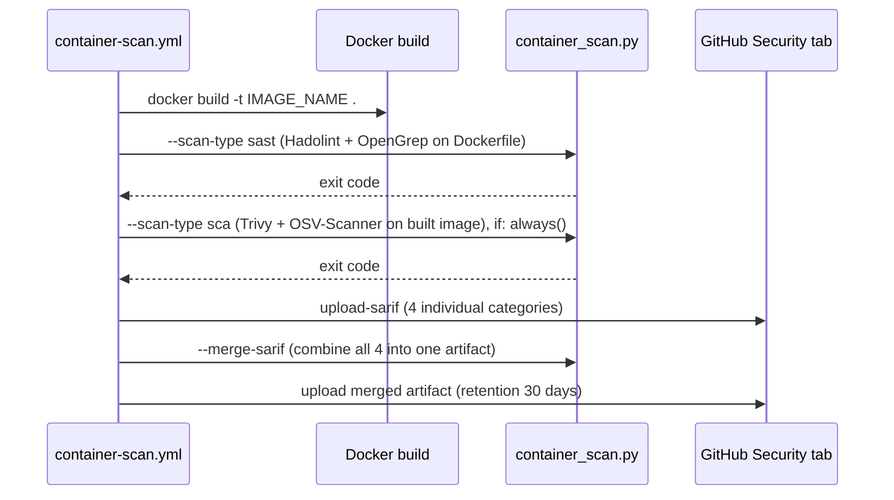

# Reference: Container Scanning Pipeline

| Property | Value |
|---|---|
| Workflow file | `container-scan.yml` |
| Orchestrator | `ci/container_scan.py` |
| Triggers | `pull_request`, `workflow_dispatch`, weekly schedule |
| Scans | The built Docker image, and the `Dockerfile` itself |
| SCA tools | Trivy, OSV-Scanner |
| SAST tools | OpenGrep |
| Linting tools| Hadolint |
| Gate model, image scan | CVSS-score gate (see [gate-status-cvss.md](gate-status-cvss.md)) |
| Gate model, Dockerfile scan | Rule-severity gate (see [gate-status-rule-severity.md](gate-status-rule-severity.md)) |
| Ecosystem-specific? | No, this pipeline scans the built image and the Dockerfile; it is identical for every language |

## Execution order



The SCA-type run executes with `if: always()`, so it still runs even if
the Dockerfile SAST step failed. This means a bad Dockerfile lint does not
prevent the image itself from being scanned for CVEs in the same job.

## CLI

`container_scan.py` is a single CLI shared by both scan types:

```
$ python3 ci/container_scan.py --help
usage: sec-orchestrator [-h] [-s {sast,sca}] [-i IMAGE] [--merge-sarif SARIF_FILE [SARIF_FILE ...]] [--merge-output MERGE_OUTPUT]

Agnostic DevSecOps Container scanning Pipeline Orchestrator

options:
  -h, --help            show this help message and exit
  -s, --scan-type {sast,sca}
                        Specify the security methodology to execute (e.g., sast, sca)
  -i, --image IMAGE     Target Docker image reference
  --merge-sarif SARIF_FILE [SARIF_FILE ...]
                        List of SARIF files to merge into one report
  --merge-output MERGE_OUTPUT
                        Output path for the merged SARIF file
```

## Environment variables

| Variable | Default | Purpose |
|---|---|---|
| `IMAGE_NAME` | none, must be set | Image reference passed to Trivy and OSV-Scanner |
| `TRIVY_IGNOREFILE` | `ci/suppress_trivy.yaml` | Trivy suppression file |
| `OSV_IGNOREFILE` | `ci/suppress_osv_scanner.toml` | OSV-Scanner suppression file |
| `TRIVY_SCA_SARIF_OUTPUT` | `sca-trivy-container.sarif` | Trivy image scan output |
| `OSV_SCA_SARIF_OUTPUT` | `sca-osv-container.sarif` | OSV-Scanner image scan output |
| `SEMGREP_CONFIG_RULESETS` | `semgrep-rules/dockerfile` | OpenGrep ruleset(s) for the Dockerfile |
| `OPENGREP_SAST_SARIF_OUTPUT` | `sast-opengrep-dockerfile.sarif` | OpenGrep Dockerfile scan output |
| `HADOLINT_SAST_SARIF_OUTPUT` | `sast-hadolint-dockerfile.sarif` | Hadolint output |
| `MERGED_SARIF_OUTPUT` | `container-scan-<service>-merged.sarif` | Combined artifact of all four SARIF files |

## Running it locally

```bash
docker build -t app:local .
bash ci/setup-tools.sh --install-tool trivy,osv-scanner,opengrep,hadolint,semgrep-rules
python ci/container_scan.py --scan-type sast
python ci/container_scan.py --scan-type sca --image app:local
```

## Workflow steps

Like SAST, `container-scan.yml` has no dependency-cache or dependency-
install step, it operates on a built image and a `Dockerfile`, neither of
which involves a package manager, so the sequence below is identical for
every ecosystem. The steps themselves are described in vendor-neutral
terms, since nothing here is specific to GitHub Actions; the
[generic GitHub Actions template](#generic-github-actions-template) below
is one concrete implementation of these same steps, not the only way to
run them:

| # | Step | Notes |
|---|---|---|
| 1 | Check out the repository | Standard source checkout |
| 2 | Set up a Python runtime | The orchestrator (`container_scan.py`) is Python |
| 3 | Build the container image (`docker build -t $IMAGE_NAME .`) | Builds the image once, reused by both scan types below |
| 4 | Install scanner tooling (`setup-tools.sh --install-tool trivy,osv-scanner,opengrep,hadolint,semgrep-rules`) | Installs all four scanner binaries in one step |
| 5 | Run the Dockerfile SAST scan (`container_scan.py --scan-type sast`) | Hadolint + OpenGrep against the `Dockerfile` |
| 6 | Run the image SCA scan (`container_scan.py --scan-type sca`), always | Trivy + OSV-Scanner against the built image, runs even if step 5 failed |
| 7 | Publish SARIF results to the code-scanning tool (x4) | One category per tool output, see [SARIF upload categories](#sarif-upload-categories) |
| 8 | Merge all SARIF reports (`container_scan.py --merge-sarif ...`), always | Combines all four SARIF files into one artifact |
| 9 | Publish the merged report as a CI artifact, always | Publishes the merged artifact, 30-day retention |


## Generic GitHub Actions template

This is a concrete, generic example of the vendor-neutral steps above,
expressed as a GitHub Actions workflow. This pipeline needs no ecosystem
substitution, the same file works for a Java, npm, Python, or Go service,
or anything else with a `Dockerfile`; on a different CI runner, the same
nine steps apply, only the workflow syntax changes:

```yaml
name: Container Vulnerability Scanning

on:
  pull_request:
  workflow_dispatch:
  schedule:
    - cron: '0 2 * * 1'

jobs:
  container-scan:
    runs-on: ubuntu-latest
    permissions:
      contents: read
      security-events: write
    env:
      IMAGE_NAME: <service>:testing
      MERGED_SARIF_OUTPUT: container-scan-<service>-merged.sarif
      TRIVY_IGNOREFILE: ci/suppress_trivy.yaml
      OSV_IGNOREFILE: ci/suppress_osv_scanner.toml
      TRIVY_SCA_SARIF_OUTPUT: sca-trivy-container.sarif
      OSV_SCA_SARIF_OUTPUT: sca-osv-container.sarif
      SEMGREP_CONFIG_RULESETS: semgrep-rules/dockerfile
      OPENGREP_SAST_SARIF_OUTPUT: sast-opengrep-dockerfile.sarif
      HADOLINT_SAST_SARIF_OUTPUT: sast-hadolint-dockerfile.sarif

    steps:
      - uses: actions/checkout@v7
      - uses: actions/setup-python@v6
        with:
          python-version: '3.14.4'

      - name: Build Docker image
        run: docker build -t ${{ env.IMAGE_NAME }} .

      - name: Setup tools
        run: bash ci/setup-tools.sh --install-tool trivy,osv-scanner,opengrep,hadolint,semgrep-rules

      - name: Run SAST scanning (Dockerfile)
        run: python ci/container_scan.py --scan-type sast

      - name: Run SCA scanning (image)
        if: always()
        run: python ci/container_scan.py --scan-type sca --image ${{ env.IMAGE_NAME }}

      - uses: github/codeql-action/upload-sarif@v4
        if: always()
        with:
          sarif_file: ${{ env.TRIVY_SCA_SARIF_OUTPUT }}
          category: trivy-container-scanning

      - uses: github/codeql-action/upload-sarif@v4
        if: always()
        with:
          sarif_file: ${{ env.OSV_SCA_SARIF_OUTPUT }}
          category: osv-scanner-container-scanning

      - uses: github/codeql-action/upload-sarif@v4
        if: always()
        with:
          sarif_file: ${{ env.OPENGREP_SAST_SARIF_OUTPUT }}
          category: opengrep-sast

      - uses: github/codeql-action/upload-sarif@v4
        if: always()
        with:
          sarif_file: ${{ env.HADOLINT_SAST_SARIF_OUTPUT }}
          category: hadolint-sast

      - name: Merge all SARIF reports
        if: always()
        run: |
          python ci/container_scan.py \
            --merge-sarif "${{ env.TRIVY_SCA_SARIF_OUTPUT }}" "${{ env.OSV_SCA_SARIF_OUTPUT }}" "${{ env.OPENGREP_SAST_SARIF_OUTPUT }}" "${{ env.HADOLINT_SAST_SARIF_OUTPUT }}" \
            --merge-output "${{ env.MERGED_SARIF_OUTPUT }}"

      - uses: actions/upload-artifact@v7
        if: always()
        with:
          name: container-scan-sarif-report
          path: ${{ env.MERGED_SARIF_OUTPUT }}
          retention-days: 30
```

> **Note on Action versions:** the `@v4`/`@v7`-style tags here are for
> readability. Pin every `uses:` to a full commit SHA in a real workflow, and
> check the tag is still current before you do, a major version can be
> retired under you, see [platform-ui.md](../case-studies/platform-ui.md) and
> [platform-backend.md](../case-studies/platform-backend.md) for real,
> SHA-pinned examples.
>
> **Ecosystem-independent by design.** This is the one pipeline of the
> three that never needs an ecosystem-specific block, whatever language or
> build tool produced the `Dockerfile`, this file doesn't change. If your
> project doesn't containerize (a library with no image, for example), this
> pipeline simply doesn't apply, run SCA and SAST only.

## SARIF upload categories

Each SARIF file uploads under its own category, to avoid GitHub's
Code Scanning upload rejecting duplicate categories from the same job:

| Tool output | Category |
|---|---|
| `TRIVY_SCA_SARIF_OUTPUT` | `trivy-container-scanning` |
| `OSV_SCA_SARIF_OUTPUT` | `osv-scanner-container-scanning` |
| `OPENGREP_SAST_SARIF_OUTPUT` | `opengrep-sast` |
| `HADOLINT_SAST_SARIF_OUTPUT` | `hadolint-sast` |

See also: [why-three-independent-pipelines.md](../explanation/why-three-independent-pipelines.md),
[why-these-tools.md](../explanation/why-these-tools.md).
