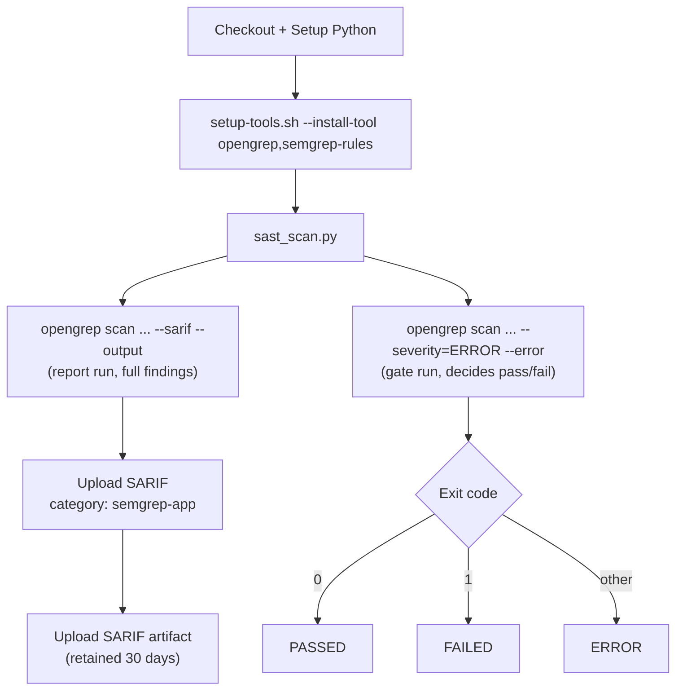

# Reference: SAST (Static Application Security Testing) Pipeline

| Property | Value |
|---|---|
| Workflow file | `sast.yml` |
| Orchestrator | `ci/sast_scan.py` |
| Triggers | `pull_request`, `workflow_dispatch`, weekly schedule |
| Scans | Application source code only, not the Dockerfile, not dependencies |
| Tool | OpenGrep |
| Gate model | Rule-severity gate (see [gate-status-rule-severity.md](gate-status-rule-severity.md)) |

## Execution order

`run_opengrep()` runs the scanner **twice**, with the same base command
and different flags each time:



Run 1 always writes the complete SARIF report, regardless of severity, so
every finding is visible in the GitHub Security tab. Run 2 is the actual
gate: it only considers `ERROR`-severity findings and exits non-zero if
any are present. This split exists so that lower-severity findings are
still recorded and visible, without being able to block the build.

## Environment variables

| Variable | Purpose |
|---|---|
| `SEMGREP_CONFIG_RULESETS` | Space-separated list of OpenGrep/Semgrep rule packs to run. This is the one part of the SAST pipeline that's language-specific, adjust it to match the languages actually present in the repository |
| `OPENGREP_EXCLUDE` | Space-separated glob patterns excluded from the scan |
| `OPENGREP_SARIF_OUTPUT` | Output path for the SARIF report |

### Choosing `SEMGREP_CONFIG_RULESETS` for a new repository

Pick rule packs that match the languages actually in the repository, plus
the generic/cross-language packs. Two worked examples from the reference
implementations:

| Repository | Stack | `SEMGREP_CONFIG_RULESETS` |
|---|---|---|
| `platform-backend` | Java / Maven | `semgrep-rules/generic semgrep-rules/problem-based-packs semgrep-rules/bash semgrep-rules/java auto semgrep-rules/yaml semgrep-rules/package_managers p/default` |
| `platform-ui` | TypeScript / npm | `semgrep-rules/generic semgrep-rules/problem-based-packs semgrep-rules/bash semgrep-rules/javascript semgrep-rules/yaml semgrep-rules/package_managers p/default semgrep-rules/json` |

For a Python repository, the equivalent starting point would swap
`semgrep-rules/java` or `semgrep-rules/javascript` for `semgrep-rules/python`;
for Go, `semgrep-rules/go`. See
[why-opengrep-not-semgrep.md](../explanation/why-opengrep-not-semgrep.md#choosing-rulesets)
for the tradeoff between stacking specific packs and using `auto`.

### `OPENGREP_EXCLUDE` by repository

| Repository | `OPENGREP_EXCLUDE` |
|---|---|
| `platform-backend` | `*.sarif ci/ Dockerfile* .pre-commit-config.yaml docs/** README.md AGENTS.md` |
| `platform-ui` | `*.sarif ci/ Dockerfile* dist/** build/** node_modules/** .angular/**` |

Exclude build output and dependency directories (`node_modules/`,
`dist/`, `build/`, `target/`, `vendor/`) for any ecosystem, scanning
generated or vendored code wastes time and produces findings that can't be
fixed at the source.

## Running it locally

```bash
bash ci/setup-tools.sh --install-tool opengrep,semgrep-rules
python ci/sast_scan.py
```

This is identical for every ecosystem, OpenGrep scans source text, it has
no dependency on a build tool or package manager.

## Workflow steps

`sast.yml` is the shortest of the three pipelines: it has no
ecosystem-specific step at all, only a language-specific *value*
(`SEMGREP_CONFIG_RULESETS`), so the sequence below never changes between
repositories, only the ruleset value does. The steps are described in
vendor-neutral terms; the
[generic GitHub Actions template](#generic-github-actions-template) below
is one concrete implementation of them:

| # | Step | Ecosystem-specific? | Notes |
|---|---|---|---|
| 1 | Check out the repository | No | Standard source checkout |
| 2 | Set up a Python runtime | No | The orchestrator (`sast_scan.py`) is Python |
| 3 | Install scanner tooling (`setup-tools.sh --install-tool opengrep,semgrep-rules`) | No | Installs OpenGrep and clones the pinned `semgrep-rules` ruleset |
| 4 | Run the SAST scan, report mode (`python ci/sast_scan.py`) | No | Writes the full SARIF report, every finding, any severity |
| 5 | Run the SAST scan, gate mode (`python ci/sast_scan.py`) | No | Same scan, `--severity=ERROR --error`, decides pass/fail |
| 6 | Publish SARIF results and the report artifact | No | One category (`semgrep-app`), plus the retained artifact |

There is no dependency-install step and no cache-restore step in this
pipeline, OpenGrep reads source files directly; it never needs a resolved
dependency tree the way the SCA pipeline's SBOM generation does.

## Generic GitHub Actions template

This is a concrete, generic example of the vendor-neutral steps above,
expressed as a GitHub Actions workflow. Unlike the SCA and Container
Scanning pipelines, this template needs no ecosystem substitution at all,
only the ruleset value changes per repository:

```yaml
name: Static Application Security Testing (SAST)

on:
  pull_request:
  workflow_dispatch:
  schedule:
    - cron: '0 2 * * 1'

jobs:
  sast:
    runs-on: ubuntu-latest
    permissions:
      contents: read
      security-events: write
    env:
      # --- the only line that changes per repository/language ---
      SEMGREP_CONFIG_RULESETS: >-
        semgrep-rules/generic semgrep-rules/problem-based-packs semgrep-rules/bash
        semgrep-rules/<your-language> semgrep-rules/yaml semgrep-rules/package_managers
        p/default
      # -------------------------------------------------------------
      OPENGREP_EXCLUDE: >-
        *.sarif ci/ Dockerfile* dist/** build/** node_modules/** target/** vendor/**
      OPENGREP_SARIF_OUTPUT: sast-opengrep-app.sarif

    steps:
      - uses: actions/checkout@v7
      - uses: actions/setup-python@v6
        with:
          python-version: '3.14.4'

      - name: Setup tools
        run: bash ci/setup-tools.sh --install-tool opengrep,semgrep-rules

      - name: Run SAST scan
        run: python ci/sast_scan.py

      - uses: github/codeql-action/upload-sarif@v4
        if: always()
        with:
          sarif_file: ${{ env.OPENGREP_SARIF_OUTPUT }}
          category: semgrep-app

      - uses: actions/upload-artifact@v7
        if: always()
        with:
          name: sast-scan-sarif-report
          path: ${{ env.OPENGREP_SARIF_OUTPUT }}
          retention-days: 30
```

> **Note on Action versions:** the `@v4`/`@v7`-style tags here are for
> readability. Pin every `uses:` to a full commit SHA in a real workflow, and
> check the tag is still current before you do, a major version can be
> retired under you, see [platform-ui.md](../case-studies/platform-ui.md) for a
> real, SHA-pinned example.
>
> **Not limited to Java or TypeScript.** `semgrep-rules/java` and
> `semgrep-rules/javascript` are what the two reference implementations
> use; OpenGrep ships packs for Python, Go, Ruby, PHP, C/C++, Rust, Kotlin,
> Terraform, and many more, swap in whichever pack (or packs) matches your
> repository's actual language(s). Nothing else in this file changes.

## Exit code to status mapping

| `opengrep` gate-run exit code | Orchestrator status |
|---|---|
| `0` | `PASSED` |
| `1` | `FAILED` (error-severity findings present) |
| anything else | `ERROR` (tool did not run correctly) |

If the expected SARIF output file doesn't exist after the run, the status
is forced to `ERROR` regardless of exit code, a missing report means the
tool didn't actually run, not that it found nothing.

See also: [why-opengrep-not-semgrep.md](../explanation/why-opengrep-not-semgrep.md).
