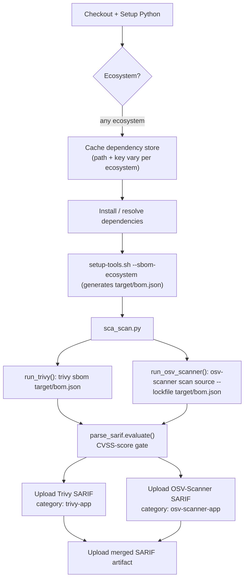

# Reference: SCA (Software Composition Analysis) Pipeline

| Property | Value |
|---|---|
| Workflow file | `sca.yml` |
| Orchestrator | `ci/sca_scan.py` |
| Triggers | `pull_request`, `workflow_dispatch`, weekly schedule |
| Scans | Application dependencies, via a generated SBOM, not the source code and not a container image |
| Tools | Trivy, OSV-Scanner |
| Gate model | CVSS-score gate (see [gate-status-cvss.md](gate-status-cvss.md)) |
| SBOM ecosystems | `maven`, `npm`, `golang`, and the `generic` Trivy filesystem fallback. Others need a new branch, see [integrate-a-new-ecosystem.md](../how-to/integrate-a-new-ecosystem.md) |

## Execution order



`sca_scan.py` itself has no ecosystem awareness at all, it only reads
`SBOM_PATH`. Everything upstream of that (dependency install, SBOM
generation) is what varies per ecosystem.

## Environment variables

| Variable | Default | Purpose |
|---|---|---|
| `SBOM_PATH` | `target/bom.json` | Path to the generated SBOM that both tools scan |
| `TRIVY_IGNOREFILE` | `ci/suppress_trivy.yaml` | Trivy suppression file |
| `OSV_IGNOREFILE` | `ci/suppress_osv_scanner.toml` | OSV-Scanner suppression file |
| `TRIVY_SARIF_OUTPUT` | `trivy-<service>.sarif` | Trivy SBOM scan output |
| `OSV_SARIF_OUTPUT` | `osv-scanner-<service>.sarif` | OSV-Scanner SBOM scan output |
| `SCA_MERGED_SARIF_OUTPUT` | `SCA-<service>-merged.sarif` | Combined artifact, not used for the gate decision itself |

## Commands run

```bash
# Trivy scans the SBOM directly
trivy sbom "$SBOM_PATH" --format sarif --ignorefile "$TRIVY_IGNOREFILE" --output "$TRIVY_SARIF_OUTPUT"

# OSV-Scanner scans the SBOM as its "lockfile" input
osv-scanner scan source --lockfile "$SBOM_PATH" --config "$OSV_IGNOREFILE" --format sarif --output-file "$OSV_SARIF_OUTPUT"
```

Note the OSV-Scanner orchestration detail: OSV-Scanner returns exit code
`1` whenever it finds any vulnerability at all, regardless of severity.
`run_osv_scanner()` treats that specific exit code as non-fatal and
remaps it to `0`, so the pipeline continues to the SARIF-based gate
evaluation instead of failing immediately on any finding. The actual
pass/fail decision comes from `parse_sarif.evaluate()` afterward, not from
OSV-Scanner's own exit code.

## Running it locally

Exact install and SBOM commands per ecosystem are in
[integrate-a-new-ecosystem.md](../how-to/integrate-a-new-ecosystem.md#ecosystem-matrix).
General shape:

```bash
<install/resolve dependencies for your ecosystem>
bash ci/setup-tools.sh --install-tool trivy,osv-scanner --sbom-ecosystem <ecosystem>
python ci/sca_scan.py
```

## Workflow steps

Every `sca.yml`, regardless of ecosystem, is the same seven steps in the
same order. Only step 3 (dependency cache) and step 4 (install/resolve)
change per ecosystem, see the
[ecosystem matrix](../how-to/integrate-a-new-ecosystem.md#ecosystem-matrix)
for the exact substitution. The steps are described in vendor-neutral
terms; the
[generic GitHub Actions template](#generic-github-actions-template) below
is one concrete implementation of them:

| # | Step | Ecosystem-specific? | Notes |
|---|---|---|---|
| 1 | Check out the repository | No | Standard source checkout |
| 2 | Set up a Python runtime | No | `parse_sarif.py` and the orchestrators are Python; this is required even for a non-Python project being scanned |
| 3 | Restore the cached dependency store | **Yes** | Path + key vary per ecosystem, see [Caching](#caching) below |
| 4 | Install / resolve dependencies | **Yes** | Runs inside `setup-tools.sh`'s `--sbom-ecosystem` branch, not as a separate workflow step. Only `generic` resolves nothing |
| 5 | Install scanner tooling and generate the SBOM (`setup-tools.sh --install-tool trivy,osv-scanner --sbom-ecosystem <ecosystem>`) | No (parameterized) | Installs the two SCA binaries and generates `target/bom.json` |
| 6 | Run the SCA scan (`python ci/sca_scan.py`) | No | Runs both tools against the SBOM, applies the CVSS-score gate |
| 7 | Publish SARIF results and the report artifact | No | One category per tool, plus the merged artifact |

Because only steps 3 and 4 differ, onboarding a new ecosystem to this
pipeline is a two-step change to the workflow file, not a rewrite, see
[integrate-a-new-ecosystem.md](../how-to/integrate-a-new-ecosystem.md).

## Caching

Cache path and key are the one piece of the pipeline that must match the
dependency manager in use. See the
[ecosystem matrix](../how-to/integrate-a-new-ecosystem.md#ecosystem-matrix)
for the exact path/key pair per ecosystem. The general rule: the cache key
must be derived from the **lockfile** (`pom.xml`, `package-lock.json`,
`go.sum`, etc.), never from the manifest alone. Hashing the wrong file
could give two different resolved dependency trees the same cache key, a
correctness bug, not just a performance one, since the cached artifacts
would then be reused across builds that should have resolved different
versions.

A minimal reference `actions/cache` step, the shape shared by every
ecosystem:

```yaml
- name: Cache dependencies
  uses: actions/cache@v6
  with:
    path: <ecosystem-specific store, e.g. ~/.m2/repository, ~/.npm, ~/go/pkg/mod>
    key: ${{ runner.os }}-<ecosystem>-v1-${{ hashFiles('<lockfile glob>') }}
    restore-keys: ${{ runner.os }}-<ecosystem>-v1-
```

Three things to keep consistent whichever ecosystem you're adding:

- **Version the key** (the `-v1-` segment). Bump it if you ever change what
  the cache stores, otherwise old and new caches can collide under the same
  key.
- **Scope the path narrowly.** Cache the package manager's own store
  (`~/.m2/repository`, not all of `~/.m2`; `~/.npm`, not `node_modules/`)
  to avoid caching stale build output or risking cache corruption.
- **Always set `restore-keys`** without the hash suffix, so a cache miss on
  an exact lockfile match still restores the closest previous cache instead
  of starting from nothing, keeping incremental installs fast even when the
  lockfile just changed.

See also: [why-sboms.md](../explanation/why-sboms.md),
[why-two-sca-tools.md](../explanation/why-two-sca-tools.md).

## Generic GitHub Actions template

This is a concrete, generic example of the vendor-neutral steps above,
expressed as a GitHub Actions workflow, with the ecosystem-specific block
called out. Swap in the matching cache path/key and install command from
the [ecosystem matrix](../how-to/integrate-a-new-ecosystem.md#ecosystem-matrix)
(`maven`, `npm`, `golang`, `generic`, or an ecosystem you have added
yourself, see
[Adding a new ecosystem](../how-to/integrate-a-new-ecosystem.md#adding-a-new-ecosystem-not-in-the-matrix)):
everything else in the file is identical regardless of language. The
cache step itself takes the exact shape shown once in
[Caching](#caching) above, only the `path`, `key`, and `restore-keys`
values change.

```yaml
name: Software Composition Analysis (SCA)

on:
  pull_request:
  workflow_dispatch:
  schedule:
    - cron: '0 2 * * 1'

jobs:
  sca:
    runs-on: ubuntu-latest
    permissions:
      contents: read
      security-events: write
    env:
      SBOM_PATH: target/bom.json
      TRIVY_IGNOREFILE: ci/suppress_trivy.yaml
      OSV_IGNOREFILE: ci/suppress_osv_scanner.toml
      TRIVY_SARIF_OUTPUT: trivy-<service>.sarif
      OSV_SARIF_OUTPUT: osv-scanner-<service>.sarif
      SCA_MERGED_SARIF_OUTPUT: SCA-<service>-merged.sarif

    steps:
      - uses: actions/checkout@v7
      - uses: actions/setup-python@v6
        with:
          python-version: '3.14.4'

      # --- ecosystem-specific block: cache step (see Caching above for the canonical shape) + install command ---
      # - name: Cache dependencies
      #   uses: actions/cache@v6
      #   with: { path: <ecosystem cache path>, key: ..., restore-keys: ... }

      - name: Install / resolve dependencies
        run: <ecosystem install command>
      # ----------------------------------------------------------------------------------------

      - name: Setup tools
        run: bash ci/setup-tools.sh --install-tool trivy,osv-scanner --sbom-ecosystem <ecosystem>

      - name: Run SCA tools
        run: python ci/sca_scan.py

      - uses: github/codeql-action/upload-sarif@v4
        if: always()
        with:
          sarif_file: ${{ env.TRIVY_SARIF_OUTPUT }}
          category: trivy-app

      - uses: github/codeql-action/upload-sarif@v4
        if: always()
        with:
          sarif_file: ${{ env.OSV_SARIF_OUTPUT }}
          category: osv-scanner-app

      - uses: actions/upload-artifact@v7
        if: always()
        with:
          name: sca-scan-sarif-report
          path: ${{ env.SCA_MERGED_SARIF_OUTPUT }}
          retention-days: 30
```

> **Note on Action versions:** the reference implementations pin every
> `uses:` to a full commit SHA with a version comment, not a floating tag.
> The tags above are for readability in this template only. Pin to a SHA
> before using this in a real workflow, and check the tag is still current
> first, a major version can be retired under you. See
> [platform-ui.md](../case-studies/platform-ui.md) and
> [platform-backend.md](../case-studies/platform-backend.md) for real,
> SHA-pinned examples.
>
> **Not limited to the branches that exist today.** `maven`, `npm`,
> `golang`, and `generic` are what `setup-tools.sh` implements right now.
> Any ecosystem with a CycloneDX SBOM generator (Gradle, Poetry, Rust/Cargo,
> PHP/Composer, Ruby/Bundler, .NET/NuGet all have one, check the
> [CycloneDX tool center](https://cyclonedx.org/tool-center/) before
> writing a custom generator) can be plugged into this same template by
> swapping the cache step, the install command, and the
> `--sbom-ecosystem` value, see
> [integrate-a-new-ecosystem.md](../how-to/integrate-a-new-ecosystem.md).
